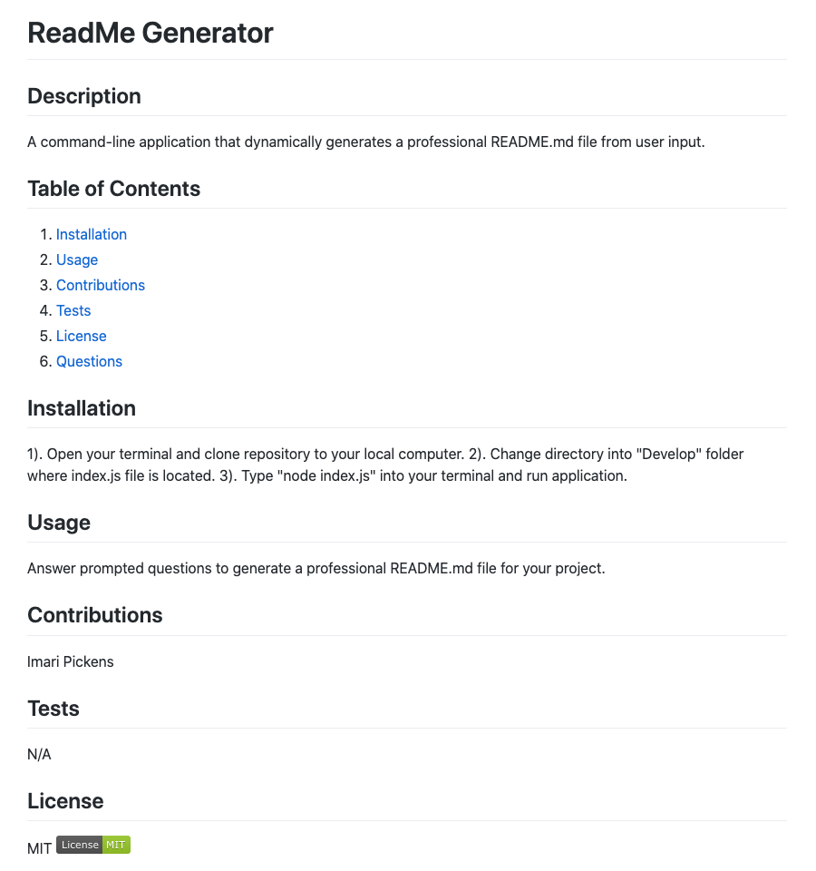

# README Generator
The purpose of this project is to create a command-line application that dynamically generates a professional README.md file from user input. 

## Motivation
The motivation behind this project was to use Node.js to create a README generator that utilizes user input to create a README file. 

## Tech/Framework Used
* Node.js
* NPM 
* Inquirer Package
* Built with Visual Code Studio

## Code Example
Here is an example of what is created with the README generator:

## Features
* Command-line prompts via Node
* Clean generated README.md file

## Installation
Clone this repository to your machine or download zip file. Using your terminal, change your directory into "Develop" folder where index.js file is located. Once inside folder, type "node index.js" into terminal to run application.

## Usage
Answer prompted questions to generate a professional README.md file for your project.

## License 
> You can reference the full license [here](https://github.com/Picke1id/README-Generator/blob/master/LICENSE).

This project is licensed under the terms of the MIT license.

## Link
* Demo URL: (https://drive.google.com/file/d/19rhsaAbFl6V_eV78cac0u0MIkkCfhb4k/view)
